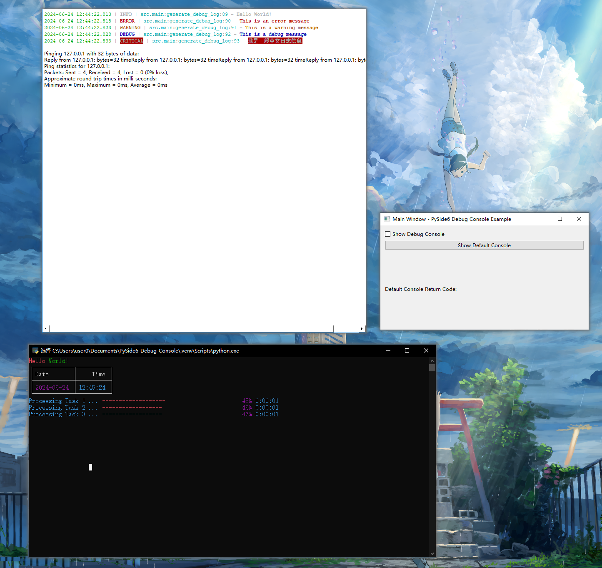

# PySide6-Debug-Console



This is a PySide6 demo that provides a colorful debug console and a default cmd console. It is based on `loguru` and `ansi2html` libraries.

Inspired by [VideoFusion](https://github.com/271374667/VideoFusion).

## Features

### 1. Colorful debug console

  1. Press `Checkbox widget` to show/hide the console.
  2. Press `ESC` in the console to hide it.
  3. MainWindow has a `Show Debug Console` checkbox widget to show/hide the console.

### 2. Default cmd console

  1. Press `PushButton widget` to launch the default cmd console.
  2. rich library is used to showoff in the console.
  
### 3. A Label widget to show default return_code

  1. 0: Success, Label widget turns green.
  2. !0: Error, Label widget turns red.

## Usage

```powershell
pip install -r requirements.txt
python run.py
```

Or

```powershell
pip install PySide6, loguru, ansi2html, rich
python run.py
```
